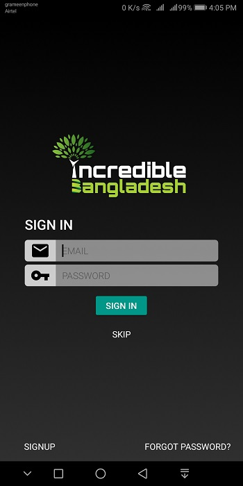
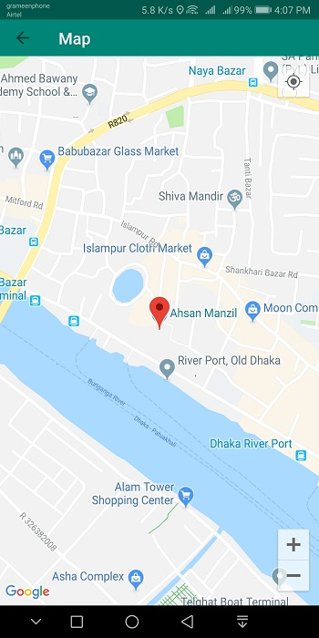

# Incredible Bangladesh

> Incredible Bangladesh is an Android application for tourists & travelers to explore the beauty of Incredible Bangladesh.

> Developed By: [Asswad Sarker Nomaan](https://www.asswadsarker.me "Asswad Sarker Nomaan")

## Introduction:

Bangladesh is one of the most beautiful countries in the world. There are many tourist places such as cultural, historical, natural places like Sundarbans, Cox’s Bazar, etc. Many tourists come to our country to visit these beautiful places. As they are foreigners they need proper guidance to know about those incredible places we have. This app will guide them and not only for them but also for us with help of Google map navigation, distances, exact location, history of that place, etc.

## What/How it works:

1. This app requires internet connection to load data for the first time, then it caches data to the phone storage for offline use.
2. User can Sign Up/Sign In for extra features but it is not necessary.
3. It loads places, destinations, image, videos etc. from firebase real-time database.
4. User can read description of places, see photos, videos, maps & also can get direction to the place.
5. Application requires Location Permission for acquiring user’s current location, Internet Permission for loading data from database.
6. User can review & rate places/destinations & add places to his/her favorite list.
7. User can see nearby places along with distance from the current place.

## Screenshots

